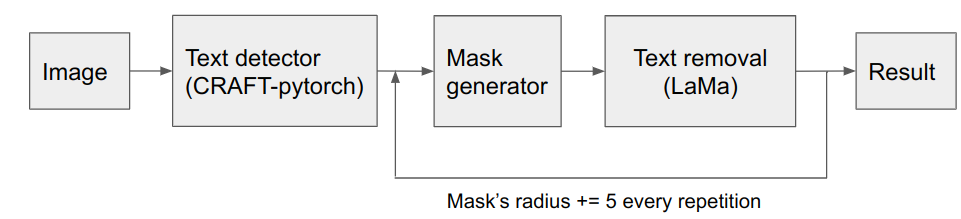

# Auto Text Removal
Auto text removal using CRAFT to detect the text and LaMa Cleaner to remove the text. Highly motivated by [`auto-lama`](https://github.com/andy971022/auto-lama) which do object detection + LaMa.

## Implementation pipeline

Applying LaMa multiple times with bigger mask creates a better result.

## How to use it
1. Clone this repository
2. Setup and download CRAFT model. Please see the official repo for the detail. Please put the downloaded model under [`CRAFT-pytorch`](https://github.com/clovaai/CRAFT-pytorch) folder. 
3. Setup and download LaMa model. Please see the official repo for the detail. Please put the downloaded model under [`LaMa`](https://github.com/advimman/lama) folder.
4. Put your input images to `images` folder
5. Run the program
```
bash script/predict_and_inpaint.sh
``` 
or
```
bash script/predict_and_inpaint.sh 5
``` 
indicating repeat LaMa 5 times (default 3 times)

> Output will be located at `results` folder and result from every repetition will located at `each_step_results` folder

## Result
Before ([Photo source](https://unsplash.com/photos/z1d-LP8sjuI))

After


## Note
I do a little modification to [`CRAFT-pytorch`](https://github.com/clovaai/CRAFT-pytorch) original code to fit my usage requirement.

## Acknowledgements
- [`CRAFT-pytorch`](https://github.com/clovaai/CRAFT-pytorch) for text detection
- [`LaMa`](https://github.com/advimman/lama) for object(text) removal